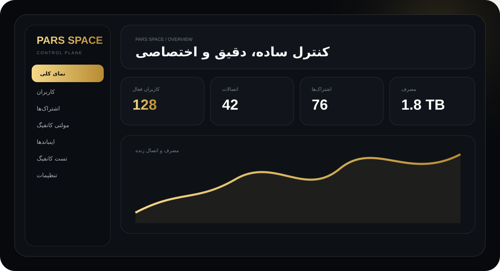
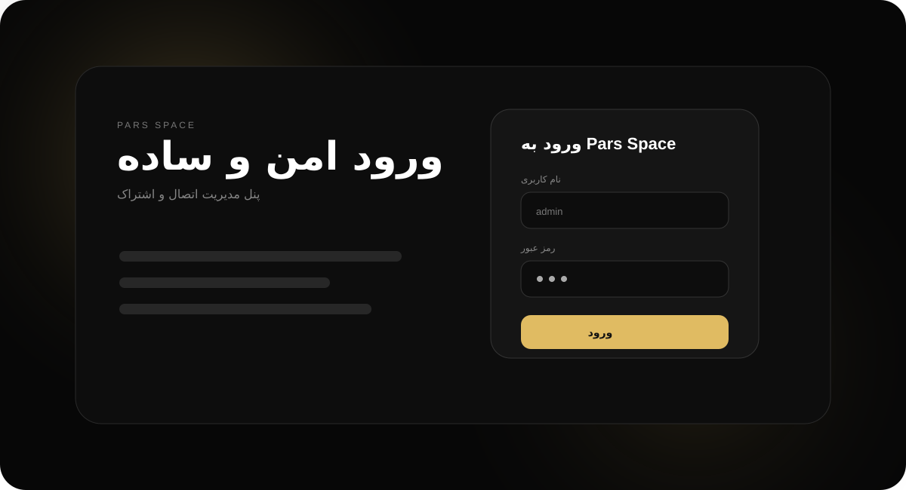
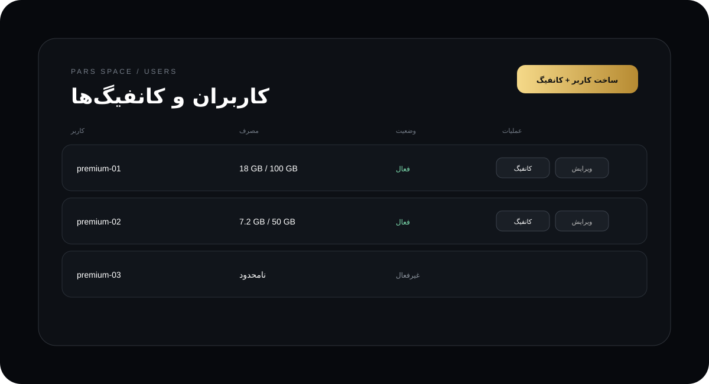
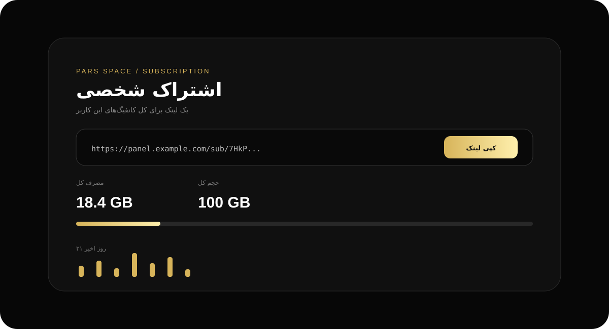
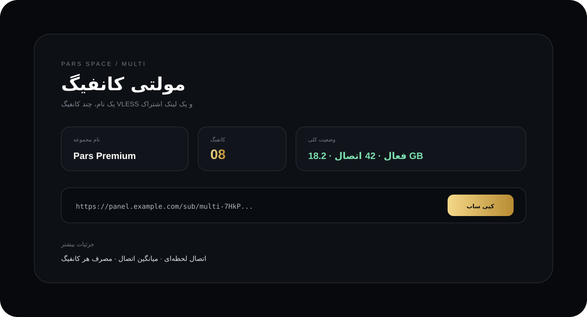
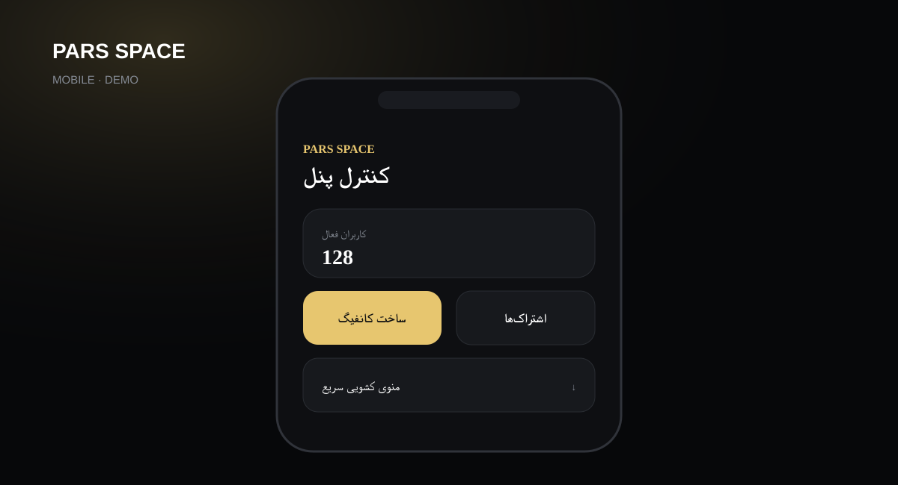

# Pars Space

پنل اختصاصی **Pars Space** برای مدیریت VLESS، کاربران، اینباندها، اشتراک‌ها و Multi Config.  
این نسخه بر پایه همین پروژه طراحی شده و ظاهر آن با هویت مستقل Pars Space بازطراحی شده است، نه Spider Panel.

## پیش‌نمایش اختصاصی

### داشبورد


### ورود


### کاربران و کانفیگ


### اشتراک


### Multi Config


### نسخه موبایل


> این تصاویر دمو هستند و به API واقعی متصل نیستند. برای مشاهده رفتار واقعی، خود پنل را اجرا کنید.

## تغییرات رابط کاربری این نسخه

- رابط Pars Space مستقل با ظاهر مشکی، طلایی و خاکستری، بدون عناصر و نام‌گذاری Spider
- README اصلی فارسی و یکپارچه
- Preview مستقل شامل داشبورد، ورود، کاربران، اشتراک و Multi Config
- منوی موبایل از بالا به پایین باز می‌شود و انیمیشن آن کوتاه و سبک است
- افکت‌های سنگین و تزئینات غیرضروری روی موبایل غیرفعال شده‌اند
- پنجره‌های ساخت و ویرایش روی موبایل به Bottom Sheet واقعی و تمام‌عرض تبدیل شده‌اند
- پنجره‌های موبایل با Bottom Sheet تمام‌عرض، بدون پنل باریک کناری و بدون اسکرول افقی نمایش داده می‌شوند
- فرم‌ها روی موبایل تک‌ستونه و مناسب لمس هستند
- پروتکل کاربر در UI فقط VLESS است و گزینه پروتکل اضافی نمایش داده نمی‌شود
- Dark Tunnel و SSH از جریان فعلی UI حذف شده‌اند
- نمایش کانفیگ کاربر در پنجره جداگانه با دکمه کپی، بدون باز کردن فرم ساخت یا ویرایش
- کپی کانفیگ و لینک اشتراک با fallback برای مرورگرهای بدون Clipboard API
- حجم مصرفی و حجم کل به صورت خطی نمایش داده می‌شوند
- مصرف روزانه ۳۱ روز اخیر برای هر کاربر قابل مشاهده است
- ریست حجم و زمان کاربر از همان مسیر و با همان کانفیگ انجام می‌شود
- نام مستعار پنل در سمت سرور ذخیره می‌شود و بعد از Refresh حفظ می‌شود
- Support Channel ID در ساخت کانفیگ و Multi Config پشتیبانی می‌شود؛ در صورت وجود، Remark با شناسه پشتیبانی و پسوند `PSP` ساخته می‌شود
- بخش اشتراک‌ها لینک‌های شخصی کاربران و Multi Config را یکجا نشان می‌دهد
- تست Sub Link تمام کانفیگ‌های قابل استخراج از آن را بررسی می‌کند و نتایج قابل دسترس را بر اساس کمترین latency مرتب می‌کند
- Multi Config شامل تعداد کانفیگ، اینباند، نام مشترک، حجم، اعتبار، Support ID، لینک اشتراک و جزئیات اتصال است
- جزئیات Multi Config مصرف، اتصال لحظه‌ای و میانگین ثبت‌شده اتصالات را نمایش می‌دهد

## ساختار

- `main.py`، Backend و API
- `static/index.html`، داشبورد واقعی Pars Space
- `static/login.html`، صفحه ورود
- `static/sub.html`، صفحه اشتراک
- `preview/dashboard-review.html`، Preview نمایشی مستقل
- `preview/assets/`، SVGهای دمو برای README
- `worker/worker.js`، Cloudflare Worker جداگانه

## اجرا

متغیرهای Railway:

- `ADMIN_USERNAME`
- `ADMIN_PASSWORD`
- `SECRET_KEY`
- `DATA_DIR=/data`

برای حفظ داده‌ها، یک Volume روی `/data` قرار دهید.

```bash
pip install -r requirements.txt
uvicorn main:app --host 0.0.0.0 --port 8080
```

## تست Sub Link

تست Sub Link در این نسخه latency/reachability شبکه را بررسی می‌کند و نتیجه‌ها را بر اساس کمترین زمان پاسخ مرتب می‌کند. این تست، اجرای کامل handshake یک کلاینت Xray را شبیه‌سازی نمی‌کند.

## نکته

Preview فقط نمایشی است و داده واقعی تولید نمی‌کند. برای عملکرد واقعی از خود `/dashboard` استفاده کنید.
