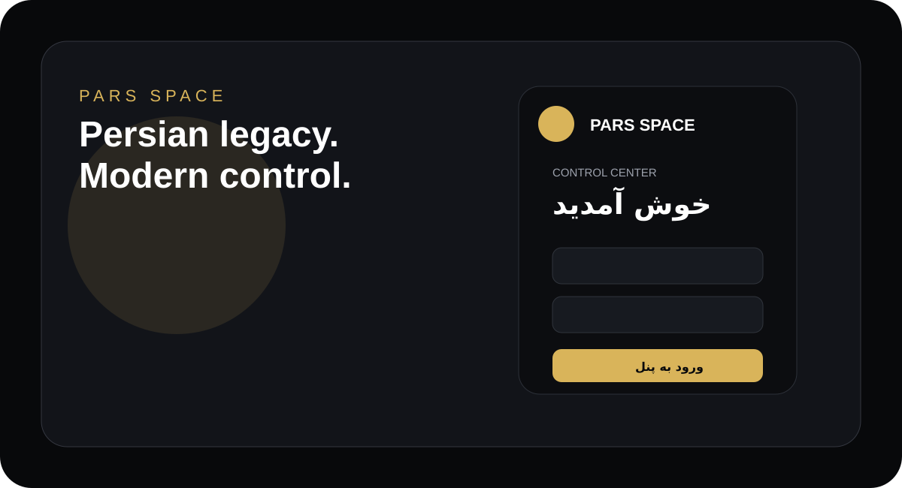
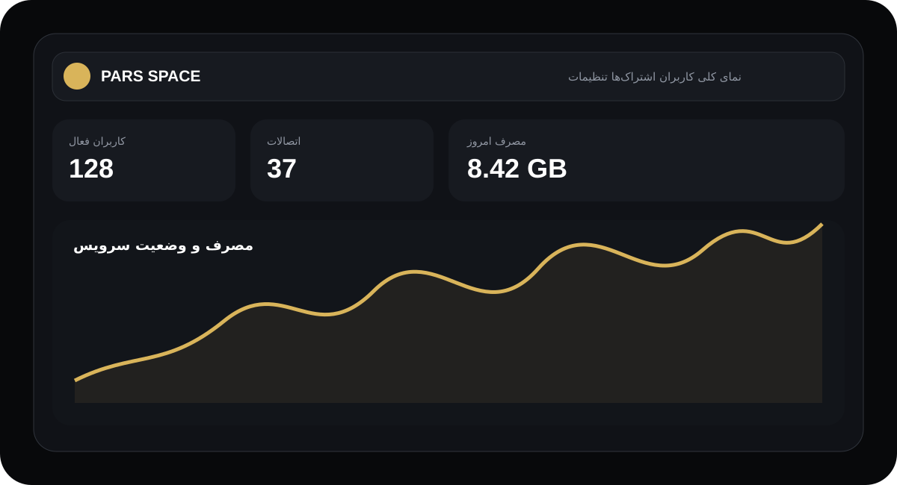
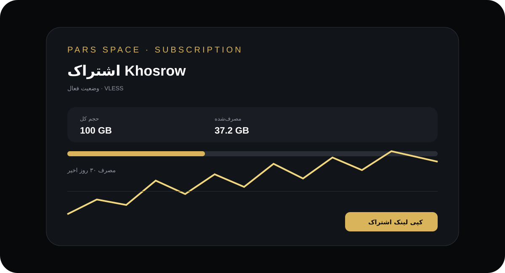

# Pars Space

**Pars Space** یک پنل مدیریت کانفیگ و اشتراک با ظاهر اختصاصی، رابط فارسی/انگلیسی و طراحی بهینه برای موبایل و دسکتاپ است. این بسته برای استقرار روی Railway آماده شده و رابط اصلی آن از `static/index.html` سرو می‌شود.

## پیش‌نمایش اختصاصی

### ورود

### پنل مدیریت

### اشتراک

> تصاویر بالا SVGهای دمو هستند و برای مستندات ساخته شده‌اند. اطلاعات داخل آن‌ها واقعی نیست.

## ساختار

- `static/index.html` پنل اصلی و متصل به API
- `static/login.html` صفحه ورود Pars Space
- `static/sub.html` صفحه اشتراک
- `preview/` پیش‌نمایش‌های دمو و SVGهای README
- `main.py` بک‌اند FastAPI
- `worker/worker.js` کد Worker جداگانه

## نکات مهم

- روی موبایل منوی اصلی به‌صورت کشویی از بالا باز می‌شود و انیمیشن‌ها کوتاه و سبک هستند.
- مودال‌های موبایل به‌صورت Bottom Sheet باز می‌شوند تا فرم‌ها از عرض صفحه بیرون نزنند.
- افکت‌های سنگین پس‌زمینه در نمایشگرهای کوچک غیرفعال شده‌اند.
- بخش نمایش کانفیگ از فرم ساخت/ویرایش جدا شده و فقط کانفیگ و دکمه کپی را نشان می‌دهد.
- پروتکل رابط کاربری برای ساخت کاربر روی VLESS ثابت شده است.

## استقرار

متغیرهای محیطی موردنیاز: `ADMIN_USERNAME`، `ADMIN_PASSWORD`، `SECRET_KEY` و `DATA_DIR=/data`. برای نگهداری اطلاعات، Volume پایدار روی `/data` تنظیم شود.

**نکته:** تست واقعی اتصال Xray، پورت‌های عمومی، Worker/KV و ترافیک زنده باید در محیط Deploy انجام شود. صرفاً باز شدن UI به معنی تست کامل سرویس شبکه نیست.
